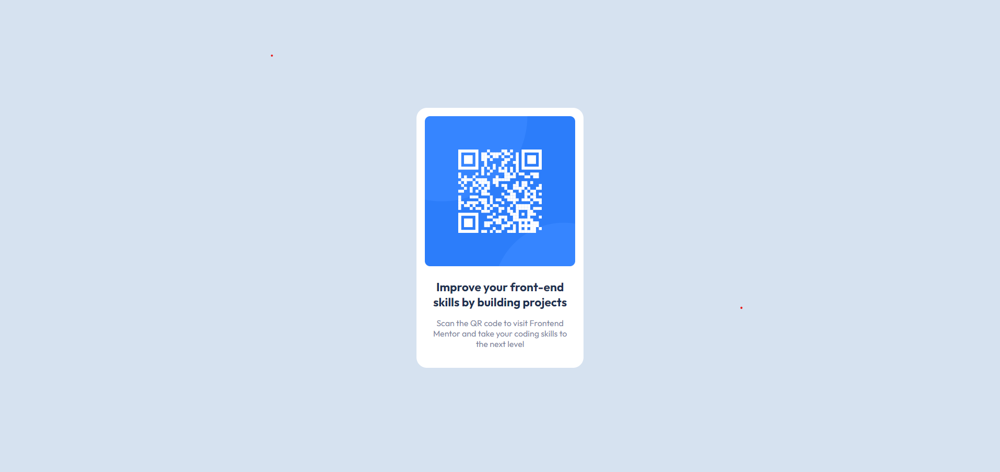

# Frontend Mentor - QR code component solution

This is a solution to the Frontend Mentor challenge [QR code component challenge on Frontend Mentor](https://www.frontendmentor.io/challenges/qr-code-component-iux_sIO_H). 

## Table of contents

- [Overview](#overview)
  - [Screenshot](#screenshot)
  - [Links](#links)
  - [Built with](#built-with)

## Overview

### Screenshot

### Links

- Solution URL: [Add solution URL here](https://your-solution-url.com)
- Live Site URL: [http://webdevrock.uk/fm/qr-code-component](http://webdevrock.uk/fm/qr-code-component)

### Built with

- Semantic HTML5 markup
- Flexbox